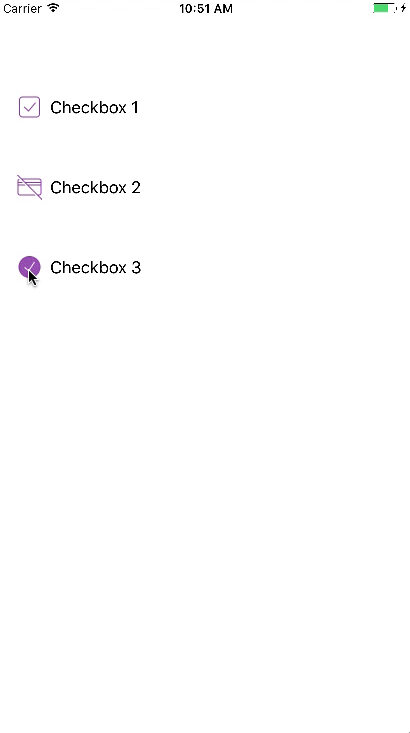

# CCheckbox-iOS
CCheckbox is a custom UIButton which represents custom checkbox component with custom images

# How To Use
- Include CCheckbox class to your project files 
- Drag UIButton to your UIViewController 
- Make it inherit from CCheckbox 
- Edit Normal Image & Selected Image from Attributes Inspector
